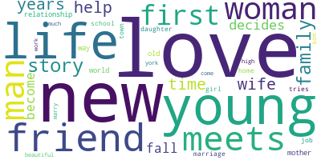

# Data Science Portfolio
## Netflix Titles Plot Popularity Detailed Analysis
study made by Jorge Garcia Navarro

### Abstract
Plot Analysis aiming to find the most popular words from each genre, creating a path to a future Machine Learning project.

The data was extracted from three separate sites:
- Netflix user ratings Dataset: https://www.kaggle.com/netflix-inc/netflix-prize-data
- IMDb official site Dataset: (title.basics.tsv.gz) https://www.imdb.com/interfaces/
- OMDb API: http://www.omdbapi.com/

## WordCloud

For further information, please refer to the documentation folder.

## ATENTION
In order for the main.ipynb to function as intented. The data folder must be replaced by the *data.zip* contents