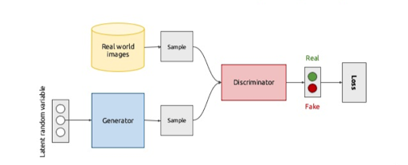
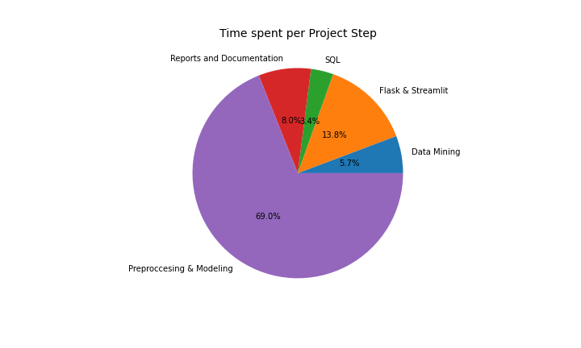

# Text Generation Machine Learning Project (GAN-Dalf)

*Designing Deep Learning models for memorable quote generation using Natural Language Processing, LSTM and GANs.*

<table align="center"> 
<tr><td width="100000"></td> 
<td style="image-align:center"> 
</td></tr> 
</table>

### Introduction
Text Generation is currently one of the most challenging fields in the Artificial Intelligence spectrum. The purpose of this project is to generate memorable movie quotes by the use of Natural Language Processing tecniques, Long-Short-Term Memory neural networks and Generative Adversarial Networks. The results of this investigation serves as an introduction to the complexity of the matter at hand, revealing interesting new paths for future projects.

This project uses **Cornell Movie-Quotes Corpus v1.0 (released July 2012)**, which consists in a collection of all-time memorable movie quotes, to which personal favourites were included. The data was cleaned and structured before attempting the preprocessing phase.

reference link: https://www.cs.cornell.edu/~cristian/memorability.html

## 2. Text Generation Modeling

### Preprocessing

The movie quotes were joined into a single corpus. The main reason for this was that the input size in a single model should be of a fixed length. The corpus was tokenized and converted into one-hot arrays. Two types of NLP tecniques were applied:

- Character-Level: Division into sequences of the same character length. These model types search for correlations between characters rather than words. This results in easily trainable models with reasonable outputs for the LSTM type models. Due to the corpus length and low computational demand, this method proved to be the most efficient regardless of its limitations.

- Word-Level: This technique of tokenizing the corpus at a word scale is the preferred preprocessing technique for the most complex models. This adds a higher compleity to the size of the input arrays, resulting in high-demand computational processing. Due to the user's hardware limitations, word-based models could not be trained as much as it was desired. In addition, word-based models require extense corpus texts in order to find correlations.

The main corpus was passed into lowercase characters, serving as input for the character-based models. For word preprocessing, the corpus text was stripped from any type of string punctuation.

The sequence length for character-based models was established as the mean length of every quote (40 characters) resulting in input array of shape (40, 52). On the other hand, sequence length for word-based models was established to 5 words for simplifying training, in expense to worst results orverall. A parameter was created for just taking into account the most frequent words, meaning that words which appear in the whole corpus with a frequency of less than 2 were not added into the token dictionary, reducing the number of input columns.

_Temperature sampling_: A standard technique introduced into the model prediction functions for improving the quality of samples from language models. Temperature sampling also introduces semantic distortions in the process, so each case may have its unique temperature value (default = 1).

## 2.1 LSTM Models

These models take an input array in order to predict the next word/character. Character-based LSTM models had a total of 52 unique characters, which resulted in shorter training preriods. Word-based models on the other hand were much more complex and due to memory problems the arrays introduced had to contain much shorter sequences.

The batch size for each epoch was established by default in 128 for each epoch.

## 2.2 GAN Models

Generative Adversarial Networks, or GANs, are an architecture for training generative models, such as deep convolutional neural networks for generating images. This is a completely different type of text generation model compared to the previous LSTM neural networks. Here, text generation will be treated in the same way as image generation.

<table align="center"> 
<tr><td width="100000"></td> 
<td style="image-align:center"> 
</td></tr> 
</table>

The base overview of a GAN model is that two models (Discriminator & Generator) work against each other to try to fool the other until both of them stabilize (therefore adversarial). The desired result is for the Generator to learn how to create outputs impossible for the discriminator to recognize as fake. In order to achieve these results, both models should be high demanding or the training period will reach stabilization too early. Tuning a GAN may be one of the most complex tasks in the Deep Learning spectrum.

Without further ado, the GAN basic structure will be explained.

### The Discriminator Model
Its role is to take a sample text sequence from the dataset as input and output a classification prediction as to whether the sample is real or fake.

Best practices suggest to define this model as a sequence of Convolution -> LeakyRelu -> Dropout Layers, setting the loss with binary crossentropy and using the Adam version of stochastic gradient descent with a learning rate of 0.0002 and a momentum of 0.5.

### The Generator Model
Its role is to generate a text sequence with enough quality to fool the discriminator. The generator is not compiled. It is trained in tandem with the discriminator.

Best practices suggest to define this model with a sequence of Dense -> LeakyRelu -> BatchNormalization Layers.

### GAN Model
The tandem sequence of Generator -> Discriminator with the same compilation configuration as the discriminator.

The training sequence is as follows:
- Generate real and fake samples and train the discriminator.
- Generate fake samples with inverted labels to train the GAN.
- Repeat until stabilization.

### Samples
There are four main functions in the sample generation:
- Latent point generation: It creates a series of random one-hot arrays with the same shape as the input.
- Fake Sample generation: Involves calling the laten point function and labeling it as fake samples.
- Real Sample generation: Involves getting real sequences from the dataset and lebeling them as real samples.
- Gan Sample generation: Calls the latent point function and labels the output as real.

*Side note: Compared to the previous LSTM models, text generation with GAN models gave underwhelming results.*

## Project Steps

<table align="center"> 
<tr><td width="100000"></td> 
<td style="image-align:center"> 
</td></tr> 
</table>